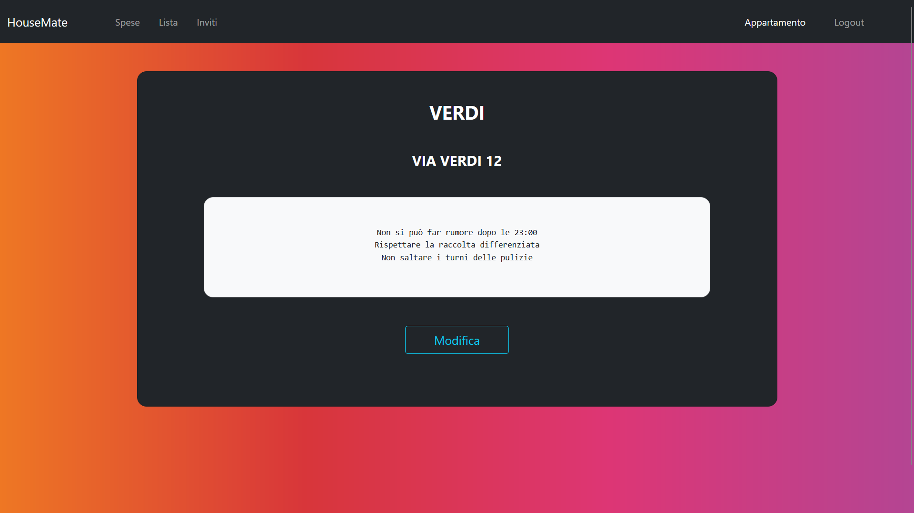

# HouseMate

HouseMate è una web app che si prefigge di aiutare studenti universitari fuorisede nell'organizzazione della vita con altri coinquilini.
Grazie ad HouseMate gli utenti possono tener traccia delle spese fatte e possono inoltre gestire una lista della spesa condivisa in modo da avere sempre sotto controllo i prodotti da comprare.

## Flow del Programma

Per iniziare ad usare HouseMate è necessario fare il signIn, se si possiede già un account, o il signUp altrimenti.

All'apertura della web app viene mostrata la schermata di signIn, nel caso in cui si fosse sprovvisti di un account si può accedere alla sezione di signUp attraverso l'apposito link.

Nella sezione di signUp sarà necessario inserire nome, cognome, una mail vaida e una password (la quale dovrà essere inserita due volte), premuto il bottone di conferma l'utente dovrà scegliere se creare un nuovo appartamento (diventandone l'owner) o se unirsi ad un appartamento già esistente con un link d'invito.

Nella sezione di singIn sarà necessario inserire email e password. Premuto il bottone di conferma possono verificarsi due diversi scenari: se l'utente fa già parte di un appartamento verrà reindirizzato alla schermata delle spese relativa al suo appartamento, se l'utente non fa già parte di un appartamento verrà reindirizzato alla schermata di scelta descritta sopra.

La schermata delle spese mostra in alto il quantitativo totale di soldi spesi da ogni membro dell'appartamento, sotto questa sezione è presente il form per inserire una nuova spesa, dovrà essere specificato il nome del prodotto e l'importo speso (in euro), in fondo alla pagina è invece presente una sezione in cui vengono mostrate le spese più recenti fatte dai membri dell'appartamento.

La schermata delle spese, come tutte le schermate che verranno descritte di seguito, è prevista di una navbar che permette di usufruire delle diverse funzionalità di HouseMate e di fare il logout.

La schermata della lista della spesa è divisa in due parti, sopra è possibile inserire una nuova spesa specificando il prodotto che va comprato e la data in cui è stato comprato l'ultima volta. Sotto è invece possibile visualizzare i prodotti presenti sulla lista della spesa.

L'owner dell'appartamento ha a disposizione la schermata di inviti dove, specificando le mail degli invitati, può genereare un token di invito per i nuovi utenti.

La schermata dell'appartamento mostra le informazioni relative all'appartamento: nome, indirizzo e regole. L'owner dell'appartamento vede anche un bottone che lo porterà alla schermata di modifica dell'appartamento.

La schermata di modifica dell'appartamento permette all'owner di modificare il nome, l'indirizzo e le regole dell'appartamento.

## Immagini

Test cases results

login

spese

lista della spesa

modifica alla lista della spesa

informazioni sull'appartamento

modifica alle informazioni sull'appartamento

